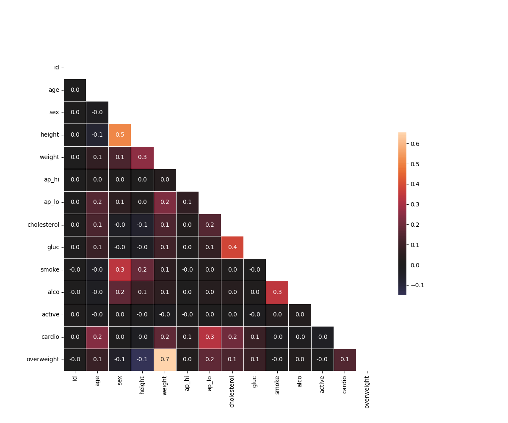

# Medical Data Visualizer

Este projeto visa **visualizar e analisar dados médicos** de pacientes para explorar a relação entre **doenças cardíacas** e fatores como **colesterol**, **glicose**, **hábitos de vida** e **medições corporais**.

## Objetivo

- Gerar dois gráficos principais:
  1. **Catplot**: Mostra a distribuição de variáveis como **colesterol**, **glicose**, **tabagismo**, **atividade física**, entre pacientes com e sem doenças cardíacas.
  2. **Heatmap**: Exibe as correlações entre variáveis como **peso**, **altura**, **pressão arterial**, etc.




## Bibliotecas Usadas

- **pandas**: Manipulação e análise de dados.
- **seaborn** e **matplotlib**: Geração de gráficos.
- **numpy**: Cálculos matemáticos.

### Instalação

Para rodar o projeto localmente, instale as dependências:

```bash
pip install pandas seaborn matplotlib numpy
